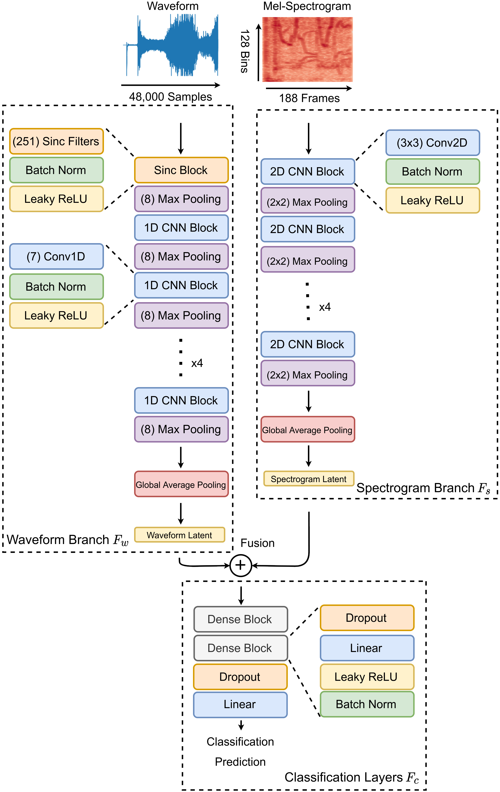

# wave-spec-fusion
Code for the 2021 DCASE Workshop paper: "Waveforms and Spectrograms: Enhancing Acoustic Scene Classification Using Multimodal Feature Fusion"

## Abstract

Acoustic scene classification (ASC) has seen tremendous progress from the combined use of convolutional neural networks (CNNs) and signal processing strategies. In this paper, we investigate the use of two common feature representations within the audio understanding domain, the raw waveform and Mel-spectrogram, and measure their degree of complementarity when using both representations for feature fusion. We introduce a new model paradigm for acoustic scene classification by fusing features learned from Mel-spectrograms and the raw waveform from separate feature extraction branches. Our experimental results show that our proposed fusion model significantly outperforms the baseline audio-only sub-network on the DCASE 2021 Challenge Task 1B (increase of 5.7\% in accuracy and a 12.7\% reduction in loss). We further show that the learned features of raw waveforms and Mel-spectrograms are indeed complementary to each other and that there is a consistent improvement in classification performance over models trained on Mel-spectrograms or waveforms alone. 

<!--  -->

| Model                   | Accuracy %  | Log Loss    | # Params    |
| -----------             | ----------- | ----------- | ----------- |
| Audio baseline          | 65.1        | 1.048       | -           |
| Waveform sub-network    | 64.79       | 1.045       | 1.0M        |
| Spectrogram sub-network | 66.46       | 1.072       | 1.1M        |
| Fusion model            | **70.78**       | **0.915**       | 1.4M        |

## Installing the Environment

We use Docker! Specifically, we use Docker, Docker Compose, and Nvidia Docker to have consistent environments to work in. To use this environment, there are two options: utilize the Nvidia Docker environment, or custom install your own python virtual environment. 

### Container Installation

* First, you must install [Docker](https://docs.docker.com/get-docker/), [Docker Compose](https://docs.docker.com/compose/install/), and [Nvidia Docker](https://docs.nvidia.com/datacenter/cloud-native/container-toolkit/install-guide.html#docker). You must also have Nvidia Drivers installed on your machine.
* Next, run `make build` to build the container.
* Run `make run` to start the Jupyter Lab environment on `localhost:8888`.
* Note: You may also run `make terminal` to open a bash terminal inside the container.

### Virtual Environment Installation

In the container, we use CUDA 10.2, but a newer installation should work as well.

## Preprocessing the Dataset
We provide a few scripts to automatically process the 2021 TAU Audio-Visual Scene dataset into the 1-second files as described in the DCASE 2021 Challenge Task1B.

To process the dataset, run these lines in the `workspace/` directory:

* `cd workspace/`
* `chmod +x scripts/download_dataset.sh`
* `chmod +x scripts/unzip_dataset.sh`
* `./scripts/download_dataset.sh`
* `./scripts/unzip_dataset.sh`